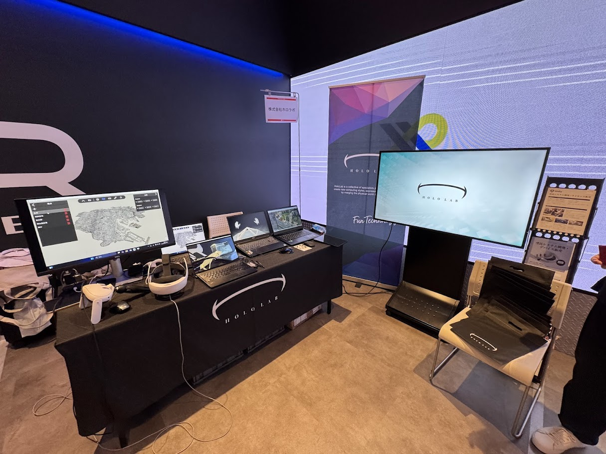

# XR Kaigi Hub in 大阪に行ってきた

# [XR Kaigi](https://xrkaigi2025.studio.site/)とは

- XR/メタバース・AR/VR/MRの最新動向を体験・議論できるイベント
- さまざまな企業・団体が展示やセッションを実施
- 今年は12/1～3

---

# XR Kaigi Hub in 大阪について

- 9/11, 12に開催
- 会場はeスタジアなんば(展示)・なんばスカイオ(セッション)

---

# セッション
- 没入感を極める！万博・大阪ヘルスケアパビリオン「モンスターハンター ブリッジ」専用ARデバイスの秘話
- Unreal Engineのイマ
- ついに登場！ Unity 6.2 とその注目の機能
- XR開発の今：多様化するデバイスと技術の選択肢（仮）

---

# 万博・大阪ヘルスケアパビリオン「モンスターハンター ブリッジ」専用ARデバイス
<table><tr><td width="50%">

</td><td width="50%" valign="top">
・Qualcomm XR2搭載、超広角ARデバイス 
・高精度6DoF測位、ジェスチャー認識
</td></tr></table>

---

# Unreal Engineのイマ
<table><tr><td width="50%">

</td><td width="50%" valign="top">
・Nanite フォリッジ 
・高速ジオメトリストリーミング 
・UEFNにAI NPC実装 
・ロイヤリティ 
・MetaHuman 
・座標系変更 
・ワークフロー統合
</td></tr></table>

---

# ついに登場！ Unity 6.2 とその注目の機能
<table><tr><td width="50%">

</td><td width="50%" valign="top">
・UI Toolkit 
・Mesh LOD 
・Graph Toolkit 
・Unity AI
</td></tr></table>

---

# XR開発の今：多様化するデバイスと技術の選択肢

- Vision Pro, Meta Quest, Android XR, Snapdragon Spaces
- OpenXRや各社独自SDKの活用

---

# 展示
- GMOペパボ株式会社
- 株式会社ホロラボ
- Utsubo（大阪商工会議所）
- Forgers
- HappyLifeCreators株式会社
- 関西学院大学 井村研究室
- 株式会社積木製作

---

# GMOペパボ株式会社

- VRChatコンテンツ制作

---

# 株式会社ホロラボ
<table><tr><td width="50%">

</td><td width="50%" valign="top">
・Dawn(軽量点群ビューア) 
・Assists(作業支援ソフト) 
・torinome(ARシミュレーション) 
・mixpace(3DCADをXRデバイス向けに変換)
</td></tr></table>

---

# Utsubo（大阪商工会議所）

- トラッキングWebコンテンツ

---

# Forgers

- RITTAI(3Dスキャン産業支援)

---

# HappyLifeCreators株式会社

- Guide01(ウェアラブルデバイス)

---

# 関西学院大学 井村研究室

- 視力回復を目的としたVRゲーム

---

# 株式会社積木製作

- VR危機回避シミュレーション

---

# 印象・学び・まとめ
- 没入感・体験性を重視した展示が多い
- XRデバイス・開発技術の多様化と進化
- 実用・産業応用の事例が増加
- 今後もXR分野の発展に注目
